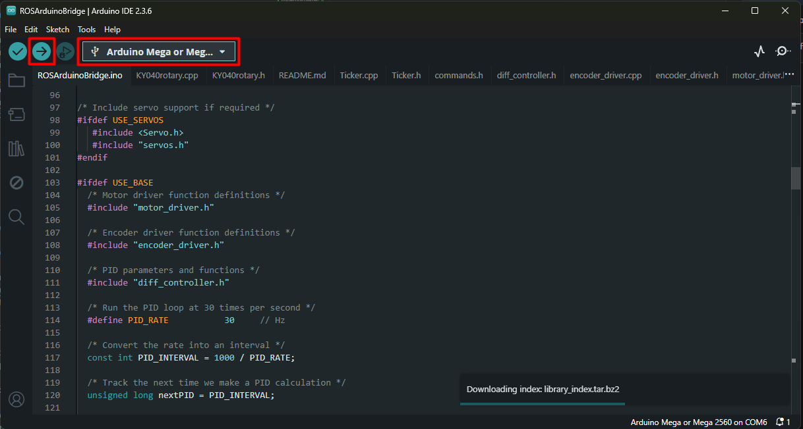
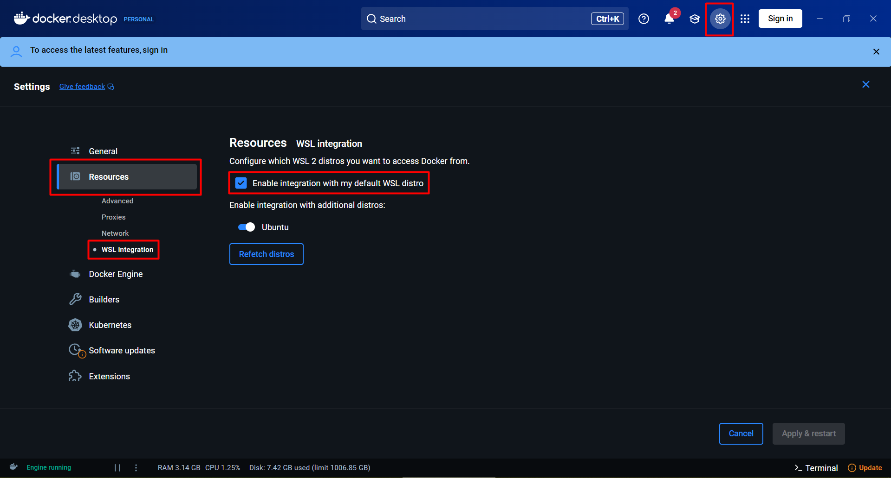
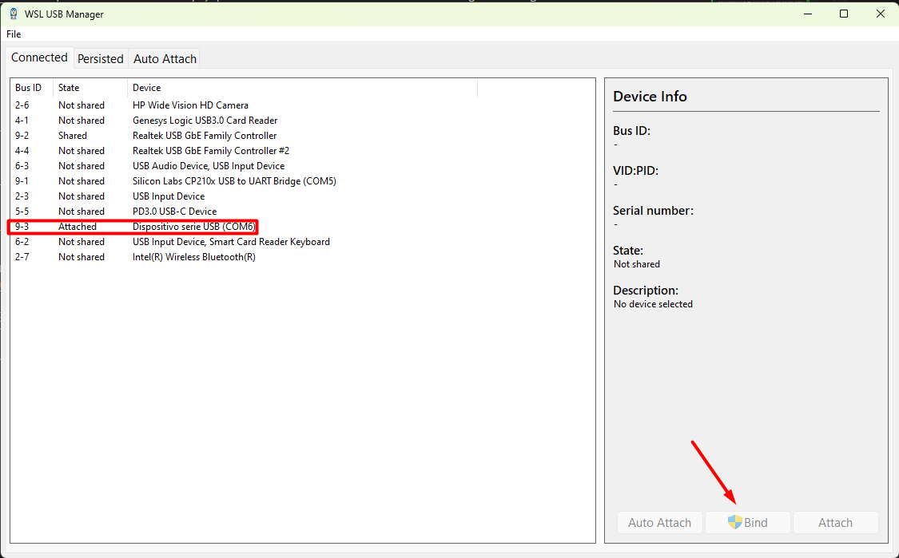
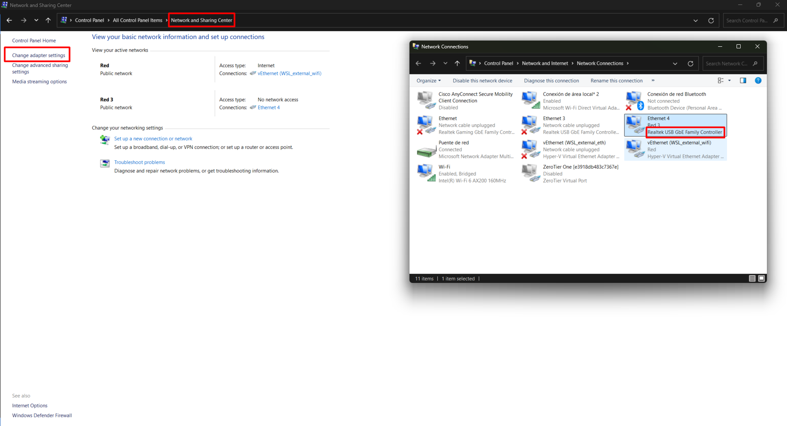
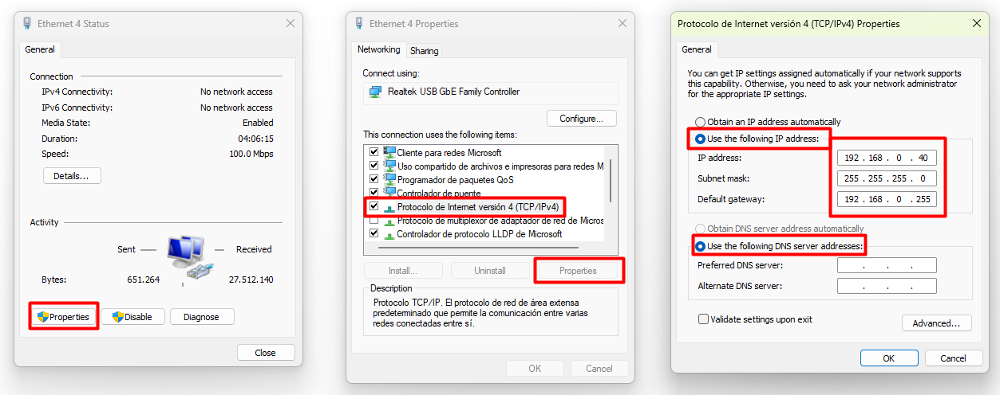

# galax_robot

Si estás leyendo esto es que te has embarcado en el apasionante de mundo de intentar controlar el Galax Robot (combinación del pioneer-3dx y el lidar hokuyo ust-10).

Avisado estás. No será fácil, por muy simplificado que lo haya dejado...

:warning: Importante:

No dejes que la batería del robot se descargue NUNCA. Vas a sudar para arreglarlo, y la persona que programó los Arduino's internos, muy probablemente esté mega jubilado o directamente fuera de comisión...

Si aún así, de fríe el Arduino que se dedica a dividir las tensiones (lo notarás porque ROS és incapaz de detectar que las ruedas del robot giran), aquí te dejo un enlace:
[Como cambiar el Arduino divisor de tensiones](how_to_fix_inner_arduino.md)

## Introducción teórica:

### ROS, Ubuntu, Docker y la madre que los parió

#### ROS

Este robot está pensado para ser controlado via [ROS2 Humble](https://docs.ros.org/en/humble/index.html). Un sistema operativo pensado para controlar robots.
ROS2 es super potente y te permite hacer todo lo que quieras.

Tiene 2 grandes virtudes:
1. Incluye un montón de librerías, herramientas y paquetes muy prácticos y útiles, tanto para controlar robots mobiles como brazos robóticos.
2. Permite con relativa facilidad que los distintos programas compartan datos.
   Un ejemplo sería que un programa se encargue de que un sensor adquiera datos y los publique, y otros dos programas cojan esos datos publicados y los usen para controlar el robot o hacer cálculos, etc...

Dicho esto, si quieres aprender a usar ROS, yo te invito a que lo hagas. Paciencia. No es fácil aprenderlo, pero una vez lo entiendas, verás lo super útil y potente que es.

Sin embargo, yo no espero que aprendas ROS. Así que te voy a dejar preparado el setup para que puedas controlar el robot sin mucho conocimiento previo de nada.

#### Ubuntu

ROS es compatible con todos los sistema operativos, pero está muy preparado para trabajar con Ubuntu. Así que eso haremos.

— Quien tiene Ubuntu a dia de hoy? — Te preguntarás...

La respuesta, es que todos los desarrolladores prefieren Ubuntu. Te permite hacer muchas más cosas que Windows, a costa de que su interfaz no es tan bonita (en nuestro caso, será todavía peor porque nuestra interfaz con ubuntu será un terminal negro :skull:), y tiene muchísima más potencia. Encima, instalar compiladores de distintos lenguajes es muy fácil.
Si en algún momento te toca hacer un programa en Python o en C++ para controlar el robot, Ubuntu será tu amigo, Windows tu peor pesadilla.

#### Docker

Una vez, un programador le envió un código a un cliente:

— Pruebe! — dijo el programador.
— No tira... No se de qué se queja de un error de librerías... — respondió el cliente.
— Ah... Tiene que instalar A, B y C, y luego hacer la vertical delante del PC.

Como entenderéis, esto es una mierda para ambos, tanto el programador como el cliente.

Aquí es donde entra Docker!
Docker es como una maquina virtual pero que es muy fácil de arrancar y de compartir. Funciona a muy bajo nivel, lo que las hace muy eficientes (no como las máquinas virtuales de verdad) y funcionan como cajas cerradas.
Si yo, el programador, pruebo el programa en mi caja cerrada y funciona, si luego te mando esa caja cerrada a ti, el cliente, también te funcionará.

Si Schrodinger hubiese usado Dockers en lugar de cajas, no hubiese planteado la teoría del gato, pero cualquier individuo podría haber comprobado si el gato estaba muerto.

## Arduino

### Código fuente
:warning: El código que el robot lleva dentro no debería ser modificado. Si aún así, se tiene que volver a subir, por razones varias, descarga la carpeta entera [ros_arduino_bridge](ros_arduino_bridge/). Dentro abre el fichero [ROSArduinoBridge.ino](ros_arduino_bridge/ROSArduinoBridge/ROSArduinoBridge.ino) y súbelo al Arduino del robot:

### Librerías

Él código y las librerías han sido todas manual y debidamente optimizadas, haciendo que los "tickers" que chequean constantemente lass lecturas de los sensores se ejecuten en paralelo y en segundo plano. No recomendamos hacer modificaciones adicionales ni debug alguno.

:warning: ROS se comunica con el Arduino usando el canal serie. Cualquier intento de debug usando `serial.print` o `serial.write`, resultará en comportamientos no deseados.

Los encoders del robot hacen TANTÍSIMAS lecturas por segundo que sobrecargan el procesador del Arduino. Para solucionar esto, el individuo que armó el robot, colocó un Arduíno intermedio (previamente mencionado en [Como cambiar el Arduino divisor de tensiones](how_to_fix_inner_arduino.md)) que se dedica a dividir el tren de lecturas de los encoders a algo manejable.

El resultado fue que el encoder puede contar pulsos de las ruedas pero es incapaz de distinguir el sentido en el que están girando (puedes probar de girar las ruedas manualmente en cualquier momento. Tienes un 50% de probabilidades de que se detecte correctamente el sentido de giro).

Para solucionar esto, la librería con los encoders de las ruedas fue modificada para imponer el sentido de giro. Cada vez que se controla los motores, se envía una señal que determina en que sentido deben contar los encoders.

:warning: Si mueves el robot manualmente, arrastrándolo por el suelo, tienes números de que la lectura de los encoders no sea correcta. Es recomendable que dejes que el robot se mueva solo. Encima, empujar el robot manualmente puede resultar en sobretensiones que quemen el puerto USB de tu PC. Cuidado!

## Configuración del PC:

**Docker**

1. Instala [Docker Desktop](https://www.docker.com/products/docker-desktop/) para Windows. Selecciona AMD64 o ARM64 según convenga. 
   
   Si no sabes cual te toca:
 
   Windows Settings -> System -> About -> Device Specifications -> System Type:

    x64-based processor = AMD64

    ARM-based processor = ARM64
2. Una vez instalado, ve a configuración y asegúrate que esta opción está seleccionada:
   

**USB's**

3. Ahora instalaremos el [USB IPD](https://github.com/dorssel/usbipd-win/releases). Descárgate el instalador (.msi) más reciente. Este programa nos servirá para conectar USB's a los contenedores de Docker.

4. Descárgate el [WSL USB Manager](https://github.com/nickbeth/wsl-usb-manager/releases/tag/v1.2.1) (no hace falta instalarlo), este es una interfaz gráfica para el anterior, que nos ayudará a conectar más fácilmente los USB's a los contenedores de Docker.

5. Busca el el "Dispositivo serie USB (COMX)" (el Arduino del robot) y haz "Bind". Si al terminar, el botón ha cambiado a "Unbind" es que lo has echo bien.
   

**LiDAR**

5. Debemos asignar una IP estática al LiDAR. Para hacer esto. Iremos al Panel de Control -> Network and Sharing Center -> Change Adapter Settings, y buscamos el que se llame "Realtek USB GbE Family Controller".
 

6. Seguidamente, Properties -> Protocolo de internet versión 4 -> Properties, y rellenamos los valores EXACTAMENTE iguales que como están en la siguiente imagen:

**Windows Server**

7. Instala el [VcXsrv Windows X Server](https://sourceforge.net/projects/vcxsrv/). Si algún programa o ejecutable de dentro del docker, quiere abrir una ventana, este programa nos permitirá hacer eso, sino, se va a quejar que no tiene acceso a ningún DISPLAY.

8. Ejecuta XLaunch. Lo encontrarás como programa instalado, sino, en `C:\Program Files\VcXsrv\xlaunch.exe`, y selecciona "Multiple Windows" y más adelante, asegúrate que "Disable access control" tiene un tick.

9.  Averigua tu IPv4 local. Puedes correr el comando `ipconfig` en una terminal de Powershell y buscar el que se llame "Ethernet adapter" si tienes conexión por cable, o "Wireless LAN adapter" si usas conexión por Wi-Fi.

**Final Test**

10. Ejecuta el siguiente comando en un terminal de cmd o Powershell, sustituyendo `TU_DIRECCIÓN_IP_LOCAL` por tu IP del paso anterior:
   
    `docker run -it --rm --name galax_robot_container --network host --privileged --device /dev --volume /dev:/dev --volume /run/udev:/run/udev --volume /var/run/dbus:/var/run/dbus --volume /etc/localtime:/etc/localtime:ro --volume /tmp/.X11-unix:/tmp/.X11-unix --volume /etc/localtime:/etc/localtime:ro --env DISPLAY=TU_DIRECCIÓN_IP_LOCAL:0.0 pep248/galax_robot:base_image`

11. Ejecuta el comando `rviz2`. Si sale algún error de DISPLAY, es que alguno del los pasos anteriores no es correcto. Si se abre una ventana de RViz, es que lo has hecho todo bien. 
   
   Ya la puedes cerrar.

Okay! En teoría ya lo tenemos todo instalado y funcionando!

:warning: El contenedor está diseñado para ser destruido cada vez que lo cierras. Tenlo en cuenta. Ningún cambio que hagas en el contenedor se conservará!

## Rutina

Ahora que lo tienes todo configurado, cada vez que quieras lanzar el robot será aplicar esta rutina:

1. Ejecuta el xLaunch, si no se estaba ejecutando ya antes.

2. Ejecuta el siguiente comando en un terminal de cmd o Powershell:

`docker run -it --rm --name galax_robot_container --network host --privileged --device /dev --volume /dev:/dev --volume /run/udev:/run/udev --volume /var/run/dbus:/var/run/dbus --volume /etc/localtime:/etc/localtime:ro --volume /tmp/.X11-unix:/tmp/.X11-unix --volume /etc/localtime:/etc/localtime:ro --env DISPLAY=TU_DIRECCIÓN_IP_LOCAL:0.0 pep248/galax_robot:base_image`

3. Ejecuta el WSL USB Manager, si no se estaba ejecutando ya antes. Busca el el "Dispositivo serie USB (COMX)" y haz "Attach".

4. Vuelve al terminal donde tienes abierto el container de docker, y ejecuta el comando que quieras:

   1. Lanzar el robot real:
      `ros2 launch galax_bringup keyboard_real_robot.launch.py`

   2. Lanzar el robot simulado:
      `ros2 launch galax_bringup keyboard_sim_robot.launch.py`

   3. Lanzar el robot real junto a la demo de navegación de la UPV:
      `ros2 launch galax_navigation launch_navigation_sim.launch.py`

   4. Lanzar el robot simulado junto a la demo de navegación:
      `ros2 launch galax_navigation launch_navigation.launch.py`

<!-- docker run -it --rm --name galax_robot_container --network host --privileged --device /dev --volume /dev:/dev --volume /run/udev:/run/udev --volume /var/run/dbus:/var/run/dbus --volume /etc/localtime:/etc/localtime:ro --volume /tmp/.X11-unix:/tmp/.X11-unix --volume /etc/localtime:/etc/localtime:ro --env DISPLAY=192.168.137.1:0.0 pep248/galax_robot:base_image

find ./src/ -type f -exec dos2unix {} + -->
