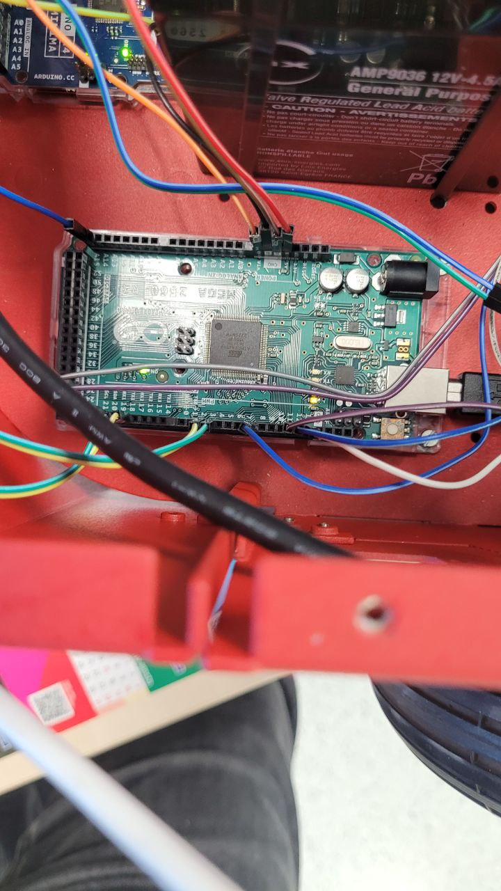
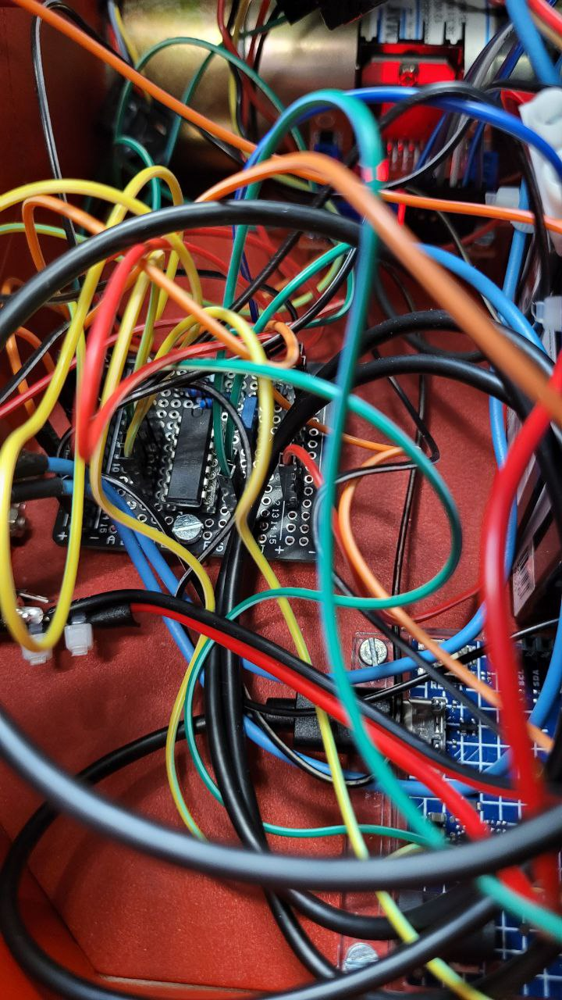
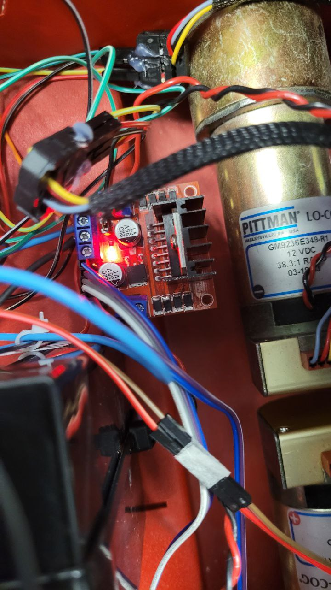
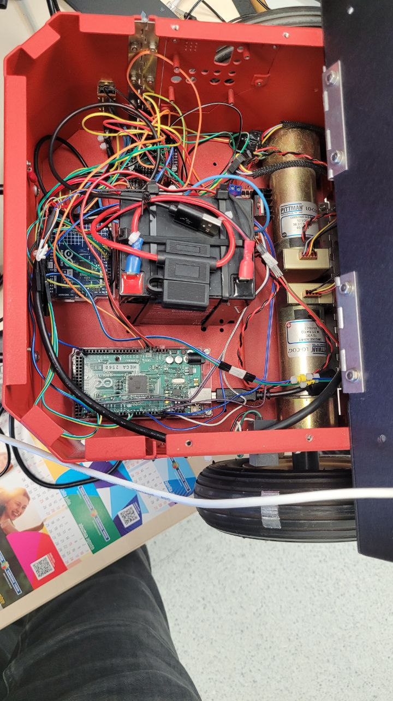
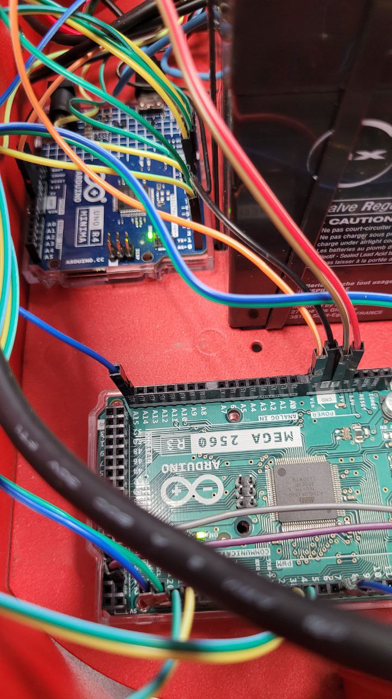
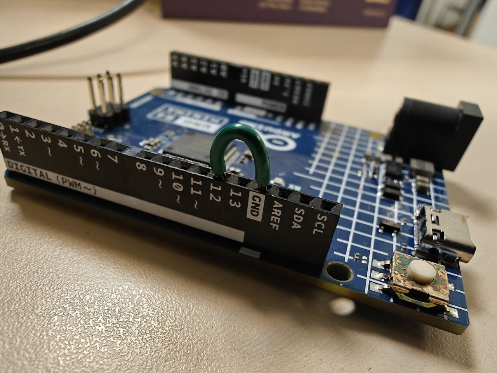
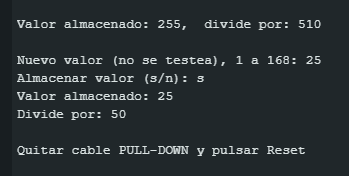

# Como arreglar el Arduino divisor de tensiones

Necesitarás un Arduino R4 nuevo, asumiendo que sea el Arduino el problema.
Si falla la lectura de vueltas de una rueda, el problema es el encoder de la rueda. Si fallan ambas, el problema es el Arduino.
También te hará falta un cable "macho-macho" para hacer un puente entre 2 conectores del propio Arduino.

1. Saca fotos de como está todo conectado (No hay planos de nada, si desconectas un cable y no sabes donde iba, estás solo en esto...)
   Aquí te añado algunas de las que saqué yo pero, nuevamente, no te la juegues.

   
   
   
   
   

2. Desconecta el Arduino R4 estropeado junto a todos los cables que tenía en sus pins y conecta el nuevo, asegurándote de volver a conectar todos los cables al correspondiente pin.

3. Haz un puente con el cable adicional entre el pin 12 i GND:
    
    (:warning: NO DESCONECTES NADA. LA IMAGEN SOLO MUESTRA EL PUENTE, PERO DEBERÍAS TENER MUCHOS OTROS CABLES CONECTADOS)

4. Conecta el nuevo Arduino a tu ordenador y abre el cliente de Arduino. Si no lo tienes instalado, puedes descargarlo de aquí [Arduino IDE](https://www.arduino.cc/en/software/#ide).

5. Descarga y abre el código que encontrarás en la carpeta [ISR_Div](./ISR_Div/ISR_Div.ino) con el Arduino IDE.
   
6. Selecciona el puerto del Arduino R4:
   

7. Abre el "Serial Monitor" y elije un Baud Rate de 115200.

8. Sube el código a la placa con la flecha de "Upload".

9. En el "Serial Monitor", aparecerá el mensaje: "Nuevo valor (no se testea), 1 a 168:"
   Introduce el valor "25" sin comillas y pulsa enter.
   Si lo has echo bien, debería quedarte esto:
   
   
10. Quita el cable que usaste para hacer el puente en el paso 3, i listo! ya debería estar arreglado! :thumbs_up: